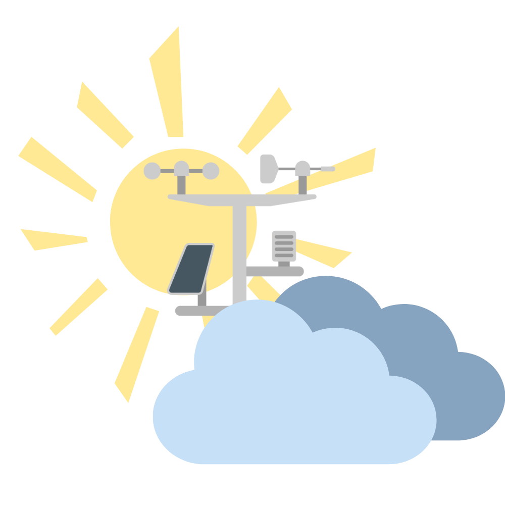
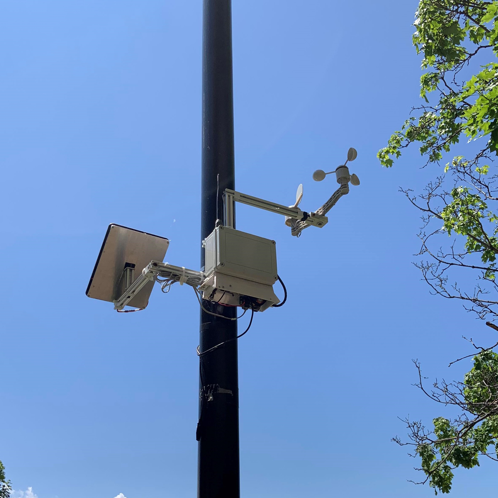

<!DOCTYPE html>
<html>
<head>
<meta charset="UTF-8">
</head>


<div id="top"></div>
<!--
Le document est une copie du ReadMe de la Station météo version école alors beaucoup de chose est à changer.


[![Contributors][contributors-shield]][contributors-url]
[![Forks][forks-shield]][forks-url]
[![Stargazers][stars-shield]][stars-url]
[![Issues][issues-shield]][issues-url]
[![MIT License][license-shield]][license-url]
[![LinkedIn][linkedin-shield]][linkedin-url]
-->

<!-- PROJECT LOGO -->

<br />
<div align="center">
  <a href="">
    
  </a>

  <h1 align="center"><b>Station Météo Climato</b></h1>
  
  <h2 align="center">Un petit pour pas pour le climat, mais un grand pour ces changements!</h2>
  
  <p align="center">
    <br>
    <a href="https://github.com/distaCAL/StationMeteo/issues">Signaler un Problème</a>
    ·
    <a href="https://github.com/distaCAL/StationMeteo/issues">Demander une fonctionnalité</a>
  </p>
</div>
 


<!-- Table des matières--------------------------------------------------------------------------------------- -->
<details>
  <summary>Table des Matières</summary>
  <ol>
    <li>
      <a href="#À-propos-du projet">À propos du projet</a>
      <ul>
        <li><a href="#Microcontrôleur">ESP32 Firebeetle</a></li>
      </ul>
    </li>
    <li>
      <a href="#Pour Commencer">Pour Commencer</a>
      <ul>
        <li><a href="#Prérequis">Prérequis</a></li>
        <li><a href="#Installation">Installation</a>
         <ul>
           <li><a href="#Choix de Carte">Choix de Carte</a></li>
           <li><a href="#Choix du Port">Comment choisir le bon port</a></li>
           <li><a href="#Installation du Programme">Installater le Programme</a></li>
         </ul>
      </ul>
    </li>
    <li><a href="#Utilités">Utilités</a></li>
    <li><a href="#Feuille de route">Feuille de route</a></li>
    <li><a href="#Contribution">Contribution</a></li>
    <li><a href="#Licenses">Licenses</a></li>
    <li><a href="#Contacts">Contacts</a></li>
    <li><a href="#Reconnaissances">Reconnaissances</a></li>
  </ol>
</details>
<hr>
<!--Intro-->
<!-- Image du projet -->
<div align="center">
  <a href="">
   <!--  -->
  </a>
  <a href="">
    
  </a>
 <div align="left">

 <!--Décrit qu'est-ce qu'est le projet à quoi il sert et le pourquoi, comment, quand? -->
  <!-- Modifier le texte pour rajouter les détails sur les capteurs -->
  <p>
    Ce présent projet à été réalisé par des étudiants-chercheurs du Cégep André-Laurendeau. Les premières itérations du projets remonte en 2019-2020 et c'est poursuivit jusqu'à l'état actuelle. Des dixaines d'étudiants, enseignant et technitiens on travailler sur le projet, tous vers le but commun de monitorer les conditions météorologiques, et d'analyser le déplacements de glacier. Le projet récolte présentement les conditions météorologiques en avant  du Cégep André-Laurendeau.
  </p>
<hr>
<!-- Capteurs--------------------------------------------------------------------------------------- -->
<h2 id="Capteurs utilisées">À propos du projet</h2>

<div align=left>
<p>
  Plusieurs capteurs on été sélectionner pour réaliser la station météo, en voici la liste complète:
</p>
</div>

<div align=center>
  <table>
    <tr>
      <th>Capteur</th>
      <th>Prix</th>
      <th>Description</th>
      <th>Datasheet</th>
    </tr>
    <tr>
      <td><a href="https://www.adafruit.com/product/3966">BME388</a></td>
      <td>9,85 USD</td>
      <td>Capteur de perssion, température et d'altitude</td>
      <td><a href="https://www.bosch-sensortec.com/media/boschsensortec/downloads/datasheets/bst-bmp388-ds001.pdf">URL</a></td>
    </tr>
    <tr>
      <td><a href="https://digilent.com/shop/pmod-tc1-k-type-thermocouple-module-with-wire/">PMOD TC1</a></td>
      <td>24,99 USD</td>
      <td>Module pour thermocouple type K</td>
      <td><a href="https://digilent.com/reference/_media/reference/pmod/pmodtc1/pmodtc1_rm.pdf">URL</a></td>
    </tr>
    <tr>
      <td><a href="https://www.dfrobot.com/product-1102.html">DHT22</a></td>
      <td>8,90 USD</td>
      <td>Capteur de température et d'humidité</td>
      <td><a href="https://wiki.dfrobot.com/DHT22_Temperature_and_humidity_module_SKU_SEN0137">URL</a></td>
    </tr>
    <tr>
      <td><a href="https://www.adeept.com/max44009_p0163.html">GY-49</a></td>
      <td>8,49 USD</td>
      <td>Capteur de l'intensité de la lumière</td>
      <td><a href="https://pdf1.alldatasheet.com/datasheet-pdf/view/434861/MAXIM/MAX44009.html">URL</a></td>
    </tr>
    <tr>
      <td><a href="https://www.sparkfun.com/products/15901">Anémomètre<br>Girouette<br>Pluiviomètre</a></td>
      <td>79,95 USD</td>
      <td>Ensemble de capteur permettant la caractérisation de la<br>vitesse/direction des vents et pour la hauteur de la pluie </td>
      <td><a href="https://cdn.sparkfun.com/assets/d/1/e/0/6/DS-15901-Weather_Meter.pdf">URL</a></td>
    </tr>
    <tr>
      <td><a href="https://www.adafruit.com/product/746">VL53L1X</a></td>
      <td>14,95 USD</td>
      <td>Capteur de distance ToF</td>
      <td><a href="https://cdn-learn.adafruit.com/assets/assets/000/105/859/original/vl53l1x.pdf?1634930163">URL</a></td>
    </tr>
    <tr>
      <td><a href="https://www.adafruit.com/product/3967">GPS</a></td>
      <td>29,95 USD</td>
      <td>Module de localisation GPS</td>
      <td><a href="https://cdn-shop.adafruit.com/product-files/746/CD+PA1616S+Datasheet.v03.pdf">URL</a></td>
    </tr>
      <tr>
      <td><a href="https://www.digikey.ca/en/products/detail/analog-devices-inc-maxim-integrated/DS3231S-T-R/1197575">RTC</a></td>
      <td>15,36 USD</td>
      <td>Chip intégré au PCB pour conserver la valeur du temps</td>
      <td><a href="https://www.analog.com/media/en/technical-documentation/data-sheets/DS3231.pdf">URL</a></td>
    </tr>
  </table>
  <div align=left>
    <p> 
      Pour l'envoi des données, deux options s'offrent. La première est avec la transmission LoRa (Long Range), un méthode utilisant des ondes radios pour l'envoie des données. La deuxième options est avec le module satellite permettant l'envoie vers un module satelitte.
      <br><br>
      Prendre note que les deux modules ne peuvent pas être connecter simultannément avec le microcontrôleur. De plus, le programme actuel utilise le module LoRa pour l'envoi des données.
    </p>
  </div>
  <table align=center>
    <tr>
      <th>Capteur</th>
      <th>Prix</th>
      <th>Description</th>
      <th>Datasheet</th>
    </tr>
    <tr>
      <td><a href="https://www.mouser.com/ProductDetail/RF-Solutions/RFM95W-915S2?qs=OlC7AqGiEDnLjhjNGiyRFA%3D%3D">LoRa</a></td>
      <td>21,00 USD</td>
      <td></td>
      <td><a href="https://www.mouser.com/datasheet/2/975/1463993415RFM95_96_97_98W-1858106.pdf">URL</a></td>
    </tr>
    <tr>
      <td><a href="https://www.sparkfun.com/products/14498">Satellite</a></td>
      <td>267,50 USD</td>
      <td></td>
      <td><a href="https://cdn.sparkfun.com/assets/6/8/6/6/d/DEV_Iridium_9603-9603N_Developers_Guide__v2.2__1_.pdf">URL</a></td>
    </tr>
    <tr>
      <td><a href="https://maxtena.com/products/f-passive/m1621hct-p-sma-iridium-passive-antenna/">Antenne satellite</a></td>
      <td>50,00 USD</td>
      <td></td>
      <td><a href="https://maxtena.com/wp-content/uploads/2021/05/M1621HCT-P-SMA.pdf">URL</a></td>
    </tr>
  </table>
</div>

<p align="right">(<a href="#top">retour au début</a>)</p>

<hr>
<!-- Microcontrôleur--------------------------------------------------------------------------------------- -->
<h2 id="Microcontrôleur"><b>ESP32 Firebeetle</b></h2>

<!-- 
Cette section devrait contenir une listes de bibliothèque et peut-être de hardware. 
Laisse les add-ons/ pluggin pour la section reconnaissance.
-->
Le microcontôleur utilisé pour cette station météo est le 
<a href="https://www.dfrobot.com/product-1590.html">ESP32 Firebeetle</a>. 
Pour bien utiliser le ESP32 Firebeetle, ouvrez Arduino et suivez les intructions suivantes:<br><br>
FICHIER > PRÉFÉRENCES > GESTIONNAIRE DE CARTES SUPPLÉMENTAIRES
<br><br>
Copiez les lignes suivantes et collez les dans la section gestionnaire de cartes supplémentaires:
 
```
https://raw.githubusercontent.com/espressif/arduino-esp32/gh-pages/package_esp32_index.json
http://arduino.esp8266.com/stable/package_esp8266com_index.json
```
<p align="right">(<a href="#top">retour au début</a>)</p>

<hr>
<!-- Librairies ---------------------------------------------------------------------------------- -->
<h2 id="Librairies"><b>Librairies</b></h2>

<p>
  Voici la liste des librairies utilisé par le programme de la station météo:
</p>
<div align=center>
  <table>
    <tr>
      <th>Librairie</th>
      <th>Description</th>
      <th>Lien</th>
    </tr>
    <tr>
      <td>Adafruit_Sensor.h</td>
      <td></td>
      <td><a href="https://github.com/adafruit/Adafruit_Sensor">URL</a></td>
    </tr>
    <tr>
      <td>Adafruit_BMP3XX.h</td>
      <td></td>
      <td><a href="https://github.com/adafruit/Adafruit_BMP3XX">URL</a></td>
    </tr>
    <tr>
      <td>Max44009.h</td>
      <td></td>
      <td><a href="https://github.com/RobTillaart/Max44009">URL</a></td>
    </tr>
    <tr>
      <td>DHT.h</td>
      <td></td>
      <td><a href="https://github.com/adafruit/DHT-sensor-library">URL</a></td>
    </tr>
    <tr>
      <td>Adafruit_MAX31855.h</td>
      <td></td>
      <td><a href="https://github.com/adafruit/Adafruit-MAX31855-library">URL</a></td>
    </tr>
    <tr>
      <td>RTClib.h</td>
      <td></td>
      <td><a href="https://github.com/adafruit/RTClib">URL</a></td>
    </tr>
    <tr>
      <td>MovingAverageFloat.h</td>
      <td></td>
      <td><a href="https://github.com/pilotak/MovingAverageFloat">URL</a></td>
    </tr>
    <tr>
      <td>SparkFun_VL53L1X.h</td>
      <td></td>
      <td><a href="http://librarymanager/All#SparkFun_VL53L1X">URL</a></td>
    </tr>
    <tr>
      <td>Adafruit_MAX31855.h</td>
      <td></td>
      <td><a href="https://github.com/adafruit/Adafruit-MAX31855-library">URL</a></td>
    </tr>
    <tr>
      <td>Adafruit_GPS.h</td>
      <td></td>
      <td><a href="https://github.com/adafruit/Adafruit_GPS">URL</a></td>
    </tr>
    <tr>
      <td>Statistic.h</td>
      <td></td>
      <td><a href="https://github.com/RobTillaart/Statistic">URL</a></td>
    </tr>
    <tr>
      <td>LoRa.h</td>
      <td></td>
      <td><a href="https://github.com/sandeepmistry/arduino-LoRa">URL</a></td>
    </tr>
    </table>
  <div align=left>
    <p>
      Le programme utilise aussi des librairies qui sont déjà intégrer dans Arduino, les voicis avec leur référence:
    </p>
  </div>
  <table>
    <tr>
      <th>Librairie</th>
      <th>Description</th>
      <th>Lien</th>
    </tr>
    <tr>
      <td>FS.h</td>
      <td></td>
      <td><a href="https://randomnerdtutorials.com/esp32-microsd-card-arduino/">URL</a></td>
    </tr>
    <tr>
      <td>SD.h</td>
      <td></td>
      <td><a href="https://github.com/arduino-libraries/SD">URL</a></td>
    </tr>
    <tr>
      <td>SoftwareSerial.h</td>
      <td></td>
      <td><a href="https://docs.arduino.cc/learn/built-in-libraries/software-serial">URL</a></td>
    </tr>
    <tr>
      <td>Wire.h</td>
      <td></td>
      <td><a href="https://reference.arduino.cc/reference/en/language/functions/communication/wire/">URL</a></td>
    </tr>
    <tr>
      <td>SPI.h</td>
      <td></td>
      <td><a href="https://www.arduino.cc/reference/en/language/functions/communication/spi/">URL</a></td>
    </tr>
    <tr>
      <td>math.h</td>
      <td></td>
      <td><a href="https://www.w3schools.com/c/c_math.php">URL</a></td>
    </tr>
  </table>
</div>

<p>
Une fois les librairies installées, la station sera en mesure d'envoyer des données via LoRa.
</p>

<hr>
<!-- Configuration LoRa ---------------------------------------------------------------------------------- -->
<h2 id="Configuration LoRa"><b>Configuration LoRa</b></h2>
<p>
  La configuration LoRa est très importante, c'est ce qui permet d'envoyer les données de la station météo vers un Gateway ou un répeteur.
  <br><br>
  Assurez-vous d'envoyer à la bonne adresse, à la bonne fréquence.
  <br><br>
  Les variables de configurations LoRa sont situé aux 
  <b>lignes 216 à 223</b> du fichier principal. Voici un exemple qui démontre à quoi cela devrais ressembler:

  ```
  byte destination              = 0xF0;     
  byte localAddress             = 0x05;   
  const uint32_t BAND           = 902500000;  
  const uint8_t LoRasyncWord    = 0x33;
  const uint8_t LoRaSF          = 10;
  const uint32_t LoRaSB         = 125E3;
  const uint8_t LoRaCR          = 5;
  ```
  Où
  <table align=center>
    <tr>
      <th>Type</th>
      <th>Variable</th>
      <th>Description</th>
      <th>Valeur<br>par défaut</th>
    </tr>
    <tr>
      <td>byte</td>
      <td>destination</td>
      <td>Adresse du gateway ou répeteur</td>
      <td></td>
    </tr>
    <tr>
      <td>byte</td>
      <td>localAddress</td>
      <td>Adresse LoRa de l'appareil</td>
      <td></td>
    </tr>
    <tr>
      <td>const uint32_t</td>
      <td>BAND</td>
      <td>Désigne la fréquence d'envoie</td>
      <td></td>
    </tr>
    <tr>
      <td>const uint8_t</td>
      <td>LoRasyncWord</td>
      <td>Mot de synchronisation entre les appareils</td>
      <td></td>
    </tr>
    <tr>
      <td>const uint8_t</td>
      <td>LoRaSF</td>
      <td>Le <i>Spreading Factor</i> à une influence direct<br> sur le débit d'envoie des octects</td>
      <td></td>
    </tr>
    <tr>
      <td>const uint32_t</td>
      <td>LoRaSB</td>
      <td></td>
      <td></td>
    </tr>
    <tr>
      <td>const uint8_t</td>
      <td>LoRaCR</td>
      <td>Le <i>Coding Rate</i> désigne la vitesse de <br>transmission des données</td>
      <td></td>
    </tr>
  </table>
  <i>Sources sur le LoRa:<a href="https://josefmtd.com/2018/08/14/spreading-factor-bandwidth-coding-rate-and-bit-rate-in-lora-english/"> Paramètres</i></a> 
</p>

<p>
Il est important de préciser que les données envoyées par LoRa doivent absolument avoir le même format que les données reçu par le Gateway ou le Répéteur.
<br><br>
Le format utilisé par la version 3.3.0 de la station météto se trouve dans l'union SBD_MO_MESSAGE et prend le format suivant :

<table align=center>
  <tr>
    <th>Type</th>
    <th>Non de la variable</th>
    <th>Description</th>
    <th>Nbre de bytes</th>
    <th>Correction</th>
  </tr>
  <tr>
    <td>uint8_t</td>
    <td>frameVersion</td>
    <td>Désigne le format utilisé<br> par l'envoie des données</td>
    <td>1 byte</td>
    <td></td>
  </tr>
  <tr>
    <td>uint8_t</td>
    <td>recipient</td>
    <td>Adresse du receveur</td>
    <td>1 byte</td>
    <td></td>
  </tr>
  <tr>
    <td>uint8_t</td>
    <td>sender</td>
    <td>Adresse local de la station</td>
    <td>1 byte</td>
  </tr>
    <tr>
    <td>uint32_t</td>
    <td>unix</td>
    <td>Secondes passées depuis<br> 1970-01-01 00:00:00 UTC</td>
    <td>4 bytes</td>
    <td></td>
  </tr>
  <tr>
    <td>int16_t</td>
    <td>bmpTemperatureC</td>
    <td>Température mesuré par <br>le BMP388</td>
    <td>2 bytes</td>
    <td></td>
  </tr>
  <tr>
    <td>int16_t</td>
    <td>dhtTemperatureC</td>
    <td>Température mesuré par <br>le DHT22</td>
    <td>2 bytes</td>
    <td></td>
  </tr>
  <tr>
    <td>int16_t</td>
    <td>tcTemperatureC</td>
    <td>Température mesuré par <br>le thermocouple</td>
    <td>2 bytes</td>
    <td></td>
  </tr>
  <tr>
    <td>uint16_t</td>
    <td>bmpPressionHPa</td>
    <td>Pression atmosphérique <br>mesuré par le BMP388</td>
    <td>2 bytes</td>
    <td></td>
  </tr>
  <tr>
    <td>uint8_t</td>
    <td>dhtHumidite</td>
    <td>Humidité mesuré par le <br>DH22</td>
    <td>1 bytes</td>
    <td></td>
  </tr>
  <tr>
    <td>uint16_t</td>
    <td>vlDistanceMM</td>
    <td>Distance mesuré par le <br>VL53L1X</td>
    <td>2 bytes</td>
    <td></td>
  </tr>
  <tr>
    <td>uint16_t</td>
    <td>gy49LuminositeLux</td>
    <td>Luminosité mesuré par <br>le GY-49</td>
    <td>2 bytes</td>
    <td></td>
  </tr>
  <tr>
    <td>int16_t</td>
    <td>bmpAltitude</td>
    <td>Altitude mesuré par le <br>BMP388</td>
    <td>2 bytes</td>
    <td></td>
  </tr>
  <tr>
    <td>uint16_t</td>
    <td>windDirection</td>
    <td>Direction du vent mesuré <br>par la girouette sur <br>16 directions (0-15)</td>
    <td>1 bytes</td>
    <td></td>
  </tr>
  <tr>
    <td>uint16_t</td>
    <td>rainHeight</td>
    <td>Hauteur de la pluie mesuré <br>par le pluiviomètre</td>
    <td>2 bytes</td>
    <td></td>
  </tr>
  <tr>
    <td>uint16_t</td>
    <td>Vin</td>
    <td>Tension mesiré de la batterie</td>
    <td>2 bytes</td>
    <td></td>
  </tr>
  <tr>
    <td>int32_t</td>
    <td>latitudeGPS</td>
    <td>Latitude mesuré par le GPS</td>
    <td>4 bytes</td>
    <td></td>
  </tr>
  <tr>
    <td>int32_t</td>
    <td>longitudeGPS</td>
    <td>Longitude mesuré par le GPS</td>
    <td>4 bytes</td>
    <td></td>
  </tr>
  <tr>
    <td>int32_t</td>
    <td>altitudeGPS</td>
    <td>Altitude mesuré par le GPS</td>
    <td>4 bytes</td>
    <td></td>
  </tr>
  <tr>
    <td>uint8_t</td>
    <td>satellites</td>
    <td>Nombre de sattelites</td>
    <td>1 byte</td>
    <td></td>
  </tr>
  <tr>
    <td>uint16_t</td>
    <td>hdop</td>
    <td>Coefficient d'affaiblissement <br>de la précision sur la composante <br>horizontale du résultat de <br>positionnement instantané</td>
    <td>2 bytes</td>
    <td></td>
  </tr>
  <tr>
    <td>uint16_t</td>
    <td>transmitDuration</td>
    <td>Durée de la transmission</td>
    <td>2 bytes</td>
    <td></td>
  </tr>
  <tr>
    <td>uint8_t</td>
    <td>transmitStatus</td>
    <td>Code de retour de la transmission <br>LoRa</td>
    <td>1 byte</td>
    <td></td>
  </tr>
  <tr>
    <td>uint16_t</td>
    <td>iterationCounter</td>
    <td>Nombre de données enregistrées</td>
    <td>2 bytes</td>
    <td></td>
  </tr>
  <tr>
    <th></th>
    <th></th>
    <th>Total :</th>
    <th>50 Bytes</th>
    <th></th>
  </tr>

</table>
</p>

<hr>
<!-- Feuille de route----------------------------------------------------- -->
<h2 id="Feuille de route">Feuille de route</h2>


<!-- montre la feuille de route -->


- [ ] Rajouter un Changelog
- [x] Rajouter back to top links (francais)
- [ ] Rajouter textes pour readme
    - [ ] Utilités 
    - [ ] Feuille de route
    - [ ] Contribution
    - [ ] License
    - [ ] Contacts
    - [ ] Reconnaissance

Voir les [Questions ouvertes](https://github.com/distaCAL/StationMeteo/issues) pour une listes complêtes de fonctionnalités demander et de problèmes connus.
<p align="right">(<a href="#top">retour au début</a>)</p>


<!-- Contribution ---------------------------------------------------------- -->
<h2 id="Contribution">Contribution</h2>


<!-- listes de personnes qui ont aidé et leur contribution. -->
Les contribution sont qu'est-ce qui fait que les communauté Èa source ouvert sont de merveilleuse places. Toutes contributions sont **grandement apprécié**.

Si vous avez une suggestion qui pourrait améliorer le projet, s'il-vous-plait créez une requête pour pull. Vous pouvez aussi ouvrir une question avec le tag "amélioration"

1. Fork the Project
2. Create your Feature Branch (`git checkout -b feature/AmazingFeature`)
3. Commit your Changes (`git commit -m 'Add some AmazingFeature'`)
4. Push to the Branch (`git push origin feature/AmazingFeature`)
5. Open a Pull Request

<p align="right">(<a href="#top">retour au début</a>)</p>


<!-- LICENSE---------------------------------------------------------------- -->
<h2 id="Licenses">Licenses</h2>
<!-- Donne la/les license(s) -->
Distribué sous la license '' Voir `` pour plus d'information.

<p align="right">(<a href="#top">retour au début</a>)</p>


<!-- Contacts ------------------------------------------------------------------- -->
<h2 id="Contacts">Contacts</h2>

<!-- rajouter les contacts -->

<div>
  <p>
    Documentation Github réalisé par : <a href="https://github.com/ApolloVL">Vincent Lavallée</a> 
    <br>
    Programme réalisé par 
    <a href="https://github.com/ApolloVL">Vincent Lavallée</a> & 
    <a href="https://github.com/ApolloVL">Thomas Perras</a>
  </p>
</div>


<p align="right">(<a href="#top">retour au début</a>)</p>


<!-- Reconnaissances ---------------------------------------------------- -->
<h2 id="Reconnaissances">Reconnaissances</h2>

<!-- inclure une liste de ressouces qui ont aidé et qui devrait être crédité voici des exemples -->


* [Choose an Open Source License](https://choosealicense.com)
* [GitHub Emoji Cheat Sheet](https://www.webpagefx.com/tools/emoji-cheat-sheet)
* [Malven's Flexbox Cheatsheet](https://flexbox.malven.co/)
* [Malven's Grid Cheatsheet](https://grid.malven.co/)
* [Img Shields](https://shields.io)
* [GitHub Pages](https://pages.github.com)
* [Font Awesome](https://fontawesome.com)
* [React Icons](https://react-icons.github.io/react-icons/search)

<p align="right">(<a href="#top">retour au début</a>)</p>


<!-- MARKDOWN LINKS & IMAGES -->
<!-- https://www.markdownguide.org/basic-syntax/#reference-style-links -->
[contributors-shield]: https://img.shields.io/github/contributors/othneildrew/Best-README-Template.svg?style=for-the-badge
[contributors-url]: https://github.com/othneildrew/Best-README-Template/graphs/contributors
[forks-shield]: https://img.shields.io/github/forks/othneildrew/Best-README-Template.svg?style=for-the-badge
[forks-url]: https://github.com/othneildrew/Best-README-Template/network/members
[stars-shield]: https://img.shields.io/github/stars/othneildrew/Best-README-Template.svg?style=for-the-badge
[stars-url]: https://github.com/othneildrew/Best-README-Template/stargazers
[issues-shield]: https://img.shields.io/github/issues/othneildrew/Best-README-Template.svg?style=for-the-badge
[issues-url]: https://github.com/othneildrew/Best-README-Template/issues
[license-shield]: https://img.shields.io/github/license/othneildrew/Best-README-Template.svg?style=for-the-badge
[license-url]: https://github.com/othneildrew/Best-README-Template/blob/master/LICENSE.txt
[linkedin-shield]: https://img.shields.io/badge/-LinkedIn-black.svg?style=for-the-badge&logo=linkedin&colorB=555
[linkedin-url]: https://linkedin.com/in/othneildrew
[product-screenshot]: images/screenshot.png

</html>